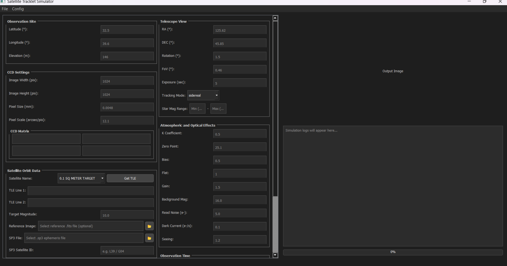
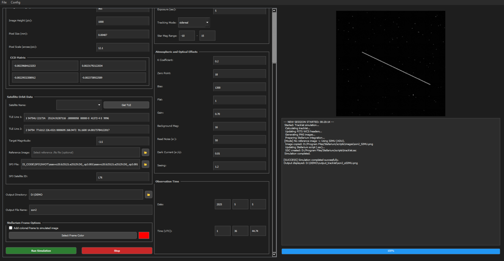
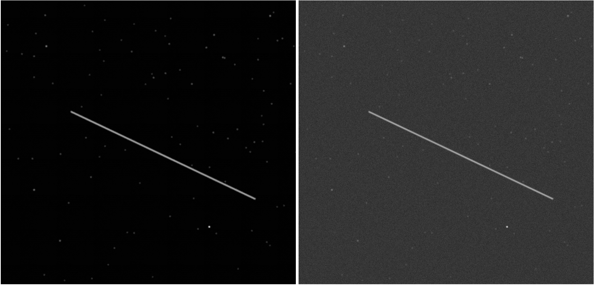
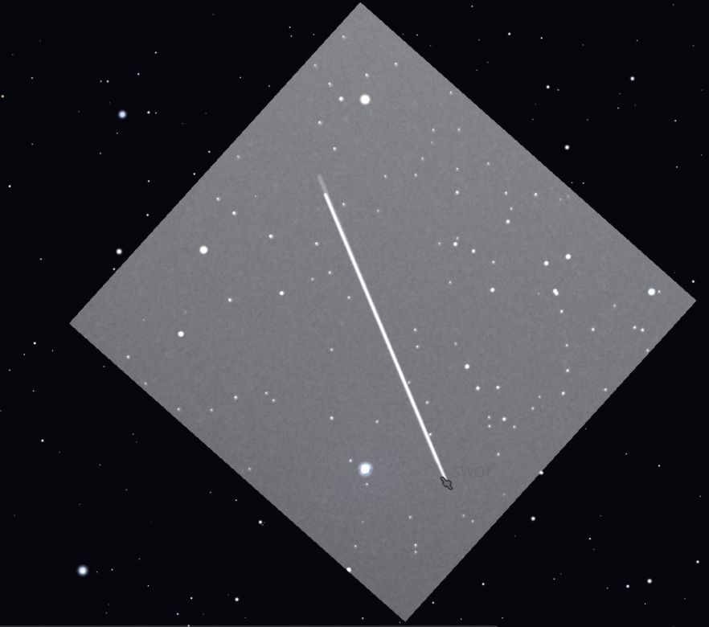

# Satellite Tracklet Generator

This repository contains the optical tracklet simulation software developed by **Pınar Hazan** as part of her MSc thesis. It provides a unified environment for generating synthetic astronomical images of satellite tracklets by combining a PyQt5-based graphical interface with independent Python modules representing different stages of the simulation.

Users define the observation, orbit, telescope, detector, and environmental parameters through the graphical interface. The software then calculates the apparent motion of the satellite, generates a realistic background star field, and renders the resulting observation.

The main outputs are synthetic astronomical images in **FITS** and **PNG** formats, representing what a telescope sensor would capture during a satellite transit. The generated images can also be displayed in Stellarium for spatial and temporal visual assessment.

---

## Software Foundations and Extensions

This project builds upon **SPIMT** and **StellariumRC**, which were adapted for the integrated satellite-tracklet simulation workflow.

[SPIMT](https://github.com/Dujunju/SPIMT) is a photon-mapping-based method for generating realistic photometric images of moving targets. Its photon-tracing and image-rendering stages consider telescope tracking mode, point spread function, light sources, and CCD characteristics. Within this project, SPIMT was extended to support satellite trajectory calculations using **SP3 precise-orbit data**, in addition to its original TLE-based workflow.

[StellariumRC](https://github.com/k96e/StellariumRC) provides access to the Stellarium Remote Control API. Its modules were adapted and integrated to display the generated images in Stellarium according to the correct observation time, observer location, and celestial position.

---

## Thesis

This software was developed within the scope of the following MSc thesis:

> **Optical Tracklet Simulation for Space Surveillance and Tracking**  
> Pınar Hazan  
> Department of Geomatics Engineering  
> Hacettepe University  
> 2026

[View the thesis record in the Council of Higher Education National Thesis Center](https://tez.yok.gov.tr/UlusalTezMerkezi/TezGoster?key=5T1_CZ5-UGb9QCmoURec4EMQht9TqDr4HGGTjeH8RuUm_cisInFxS0WwA3dpi2BJ)

### Suggested Citation

```bibtex
@mastersthesis{hazan2026optical,
  author  = {Hazan, Pınar},
  title   = {Optical Tracklet Simulation for Space Surveillance and Tracking},
  school  = {Hacettepe University},
  year    = {2026},
  type    = {Master's Thesis},
  url     = {https://tez.yok.gov.tr/UlusalTezMerkezi/TezGoster?key=5T1_CZ5-UGb9QCmoURec4EMQht9TqDr4HGGTjeH8RuUm_cisInFxS0WwA3dpi2BJ}
}
```

When using this software in academic work, please cite both the thesis and this repository.

---

## Example Outputs

### Graphical User Interface





### Synthetic Satellite Tracklet



### Stellarium Visualisation



---

## Software Workflow

The software combines the individual simulation stages through the following workflow:

```text
User-defined parameters
        │
        ▼
Graphical user interface
        │
        ▼
Observation and sensor configuration
        │
        ▼
Orbit-source selection
   ┌────┴────┐
   │         │
  TLE       SP3
   │         │
   └────┬────┘
        ▼
Satellite position and apparent-motion calculation
        │
        ▼
Background-star catalogue query
        │
        ▼
Photon-based image simulation
        │
        ▼
FITS image generation
        │
        ▼
PNG conversion
        │
        ▼
Stellarium sky-overlay generation
```

---

## Requirements

### Software Requirements

- Python 3.13
- Stellarium desktop application
- Git
- Internet connection for online catalogue and TLE queries

The software was developed and tested primarily on Windows 11.

### Python Dependencies

The required Python packages are listed in:

```text
requirements.txt
```

---

## Installation

### 1. Clone the Repository

```bash
git clone https://github.com/hzn-pnr/satellite-tracklet-generator.git
cd satellite-tracklet-generator
```

### 2. Create a Virtual Environment

#### Windows Command Prompt

```bash
python -m venv .venv
.venv\Scripts\activate
```

#### Windows PowerShell

```powershell
python -m venv .venv
.\.venv\Scripts\Activate.ps1
```

### 3. Install the Dependencies

```bash
python -m pip install --upgrade pip
pip install -r requirements.txt
```

---

## Configuration

Machine-specific paths and optional Space-Track credentials are defined in the local `config.ini` file.

Example:

```ini
[spacetrack]
username = YOUR_SPACE_TRACK_USERNAME
password = YOUR_SPACE_TRACK_PASSWORD

[paths]
stellarium_scripts = PATH_TO_STELLARIUM_SCRIPTS_DIRECTORY
```

Do not commit a `config.ini` file containing real account credentials.

### Space-Track Configuration

A [Space-Track.org](https://www.space-track.org/) account is required only when the automatic TLE retrieval functionality is used.

The software can alternatively operate with:

- TLE lines entered manually
- A local SP3 precise-orbit file

### Stellarium Scripts Directory

The `stellarium_scripts` setting must point to the Stellarium `scripts` directory.

Example:

```ini
[paths]
stellarium_scripts = D:\Program Files\Stellarium\scripts
```

The application places generated visualisation images in the corresponding `images` subdirectory:

```text
D:\Program Files\Stellarium\scripts\images
```

The exact directory may differ depending on the Stellarium installation. Ensure that the selected directory exists and that the application has permission to write files into it.

---

## Stellarium Setup

Stellarium must be installed separately and is not distributed with this repository.

### 1. Install Stellarium

Download and install the desktop application from the [official Stellarium website](https://stellarium.org/).

### 2. Enable the Remote Control Plugin

The Remote Control plugin must be active before the generated images can be displayed in Stellarium.

1. Open Stellarium.
2. Open the **Configuration Window**.
3. Go to the **Plugins** tab.
4. Select **Remote Control**.
5. Enable **Load at startup**.
6. Restart Stellarium.
7. Open the Remote Control plugin settings.
8. Start the Remote Control server.
9. Optionally enable automatic server startup.
10. Keep the port set to `8090`.

The software communicates with Stellarium through:

```text
http://127.0.0.1:8090
```

The connection can be tested in a browser while Stellarium is running:

```text
http://localhost:8090
```

### Generated Stellarium Files

During the visualisation stage, the application may create the following files:

```text
scripts/
├── tracklet.ssc
└── images/
    ├── <output_name>_SIMU.png
    ├── <output_name>_eSIMU.png
    └── [optional reference image]
```

---

## Running the Application

Activate the Python virtual environment and start the graphical application:

```bash
python gui.py
```

For Stellarium visualisation, start Stellarium and confirm that the Remote Control server is active before running the simulation.

---

## Demo Application

A sample parameter file is provided in the `demo/` directory. It can be used to test the software without entering all simulation parameters manually.

### 1. Load the Demo File

From the application menu, select:

```text
File → Upload File
```

Choose the sample `.txt` file located in the `demo/` directory. The corresponding input fields in the graphical interface will be populated automatically.

### 2. Review the Configuration

Before starting the demo:

- Confirm that Space-Track credentials are defined in `config.ini` when automatic TLE retrieval is required.
- Confirm that the Stellarium scripts directory is correctly defined when Stellarium visualisation will be used.
- Confirm that the output directory specified in the demo parameter file exists.

### 3. Run the Simulation

Click **Run** to start the simulation.

Each processing stage is displayed in the application log console, including orbit processing, satellite-motion calculation, background-star generation, image simulation, and output generation.

If an error occurs, the simulation can be stopped, the relevant parameter or configuration setting can be corrected, and the process can then be restarted.

### 4. Review the Results

The generated FITS and PNG files are saved in the output directory specified in the demo parameter file.

- If Stellarium is not running, the simulation outputs are still generated and saved locally.
- If Stellarium is running and the Remote Control plugin is active, the generated image is additionally displayed in Stellarium according to the observation time, observer location, and celestial coordinates defined in the input file.
